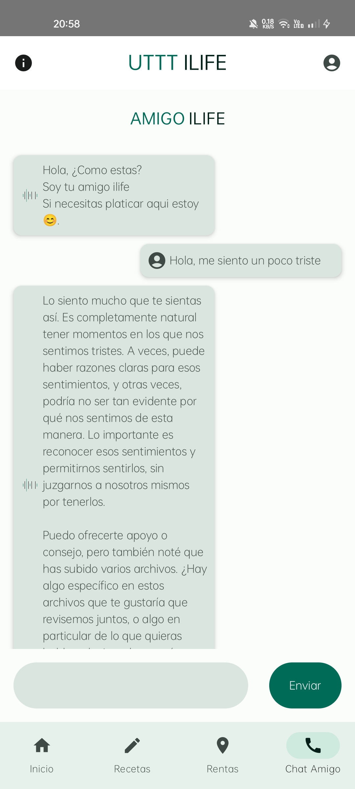

# UTTT ILIFE

<h3 align="center">
Simplifica tu vida universitaria 🎓 
</h3>

## Descripción

UTTTILIFE es una aplicación móvil diseñada para transformar la experiencia universitaria, ofreciendo una solución integral y centrada en el usuario para la gestión del tiempo y el acceso a recursos y servicios esenciales. Con funcionalidades como la gestión de horarios y la búsqueda de alojamiento, UTTTILIFE se dedica a simplificar la vida universitaria. Una novedad significativa es el enfoque en la salud mental, proporcionando un espacio interactivo donde los estudiantes pueden obtener apoyo a través de un chat basado en inteligencia artificial. Este chat sugiere lecturas y recursos basados en una amplia biblioteca de libros de psicología, personalizando las recomendaciones para cada usuario. Al combinar accesibilidad y eficiencia, UTTTILIFE empodera a los estudiantes para alcanzar sus metas académicas y personales, afrontando los desafíos universitarios con mayor confianza y apoyo.

## 📱 Imagenes de la app

## Instalación

1. **Descargar el APK:** [Enlace para descargar el APK](apks/)

2. **Instalar en Dispositivo Android:** Después de descargar el APK, transfiera el archivo a su dispositivo Android y ábralo para iniciar el proceso de instalación. Es posible que deba habilitar la instalación de aplicaciones desde fuentes desconocidas en la configuración de su dispositivo.

## Autores

Proyecto desarrollado por alumnos de la Universidad Tecnologica Tula Tepeji

Si tienes alguna pregunta o sugerencia sobre el proyecto, no dudes en ponerte en contacto con nosotros a través de [correo electrónico](mailto:utttilife@gmail.com).

---

¡Gracias por tu interés en nuestro proyecto!

## Tecnologias usadas para el desarrollo de la aplicacion

     </a>   <a href="https://reactjs.org/" target="_blank" rel="noreferrer">

